# Wet Run — 시스템 아키텍처 설계 문서

**작성일**: 2026-08-19
**대상 독자**: 게임 디자이너, 신규 AI 에이전트, 외부 기여자
**범위**: Wet Run v1.1.0a1 (Phase 48 완료 시점, ~214 source files + 237 test files)
**상태**: 초안 (Draft) — 사용자 검토 후 Accepted ADR 승격 가능

---

## 목차 (Table of Contents)

### §1-§9: 아키텍처 개요
- [§1. 문서 목적](#1-문서-목적)
- [§2. 시각화 방법 비교](#2-시각화-방법-비교) — 7종 비교, Mermaid 선택
- [§3. 고수준 아키텍처](#3-고수준-아키텍처-3-layer-model) — 1st Mermaid
- [§4. 모듈 맵](#4-모듈-맵-module--파일-수) — 214 src files
- [§5. 데이터 파이프라인](#5-데이터-파이프라인-json--engine-state--render) — 2nd Mermaid
- [§6. 게임 루프](#6-게임-루프-macro--micro) — 3rd + 4th Mermaid
- [§7. 시나리오 계층](#7-시나리오-계층-구조) — 5th Mermaid
- [§8. 콘텐츠 인벤토리](#8-콘텐츠-인벤토리-2026-08-19-기준) — 6th Mermaid (pie)
- [§9. ADR 현황](#9-adr-현황-architecture-decision-records) — 7th Mermaid (stateDiagram)

### §10-§13: 분석 + Cross-Project
- [§10. 갭 분석](#10-갭-분석-부족한-부분--미구현--미문서화) — 3 카테고리
- [§11. Cross-Project 의존성](#11-cross-project-의존성) — 8th Mermaid
- [§12. 향후 다이어그램 추천](#12-향후-다이어그램-권장-작업) — 8개 후보
- [§13. 참고 자료](#13-참고-자료-references) — 소스/데이터/ADR 링크

### §14-§19: 심층 분석 (Deep Dive)
- [§14. ECS vs OOP 매트릭스](#14-ecs-vs-oop-매트릭스-코드-아키텍처-실태-분석) — 9th Mermaid, ADR-0194 cross-link
- [§15. Death → Restart 시퀀스](#15-death--restart-시퀀스-adr-0040) — 10th Mermaid (sequenceDiagram), 6 발견
- [§16. AppState 클래스 아키텍처](#16-appstate-클래스-아키텍처-central-state-container) — 11th Mermaid (classDiagram), 10 카테고리
- [§17. 데이터 모델 ER](#17-데이터-모델-er-다이어그램-mission--ice--equipment--faction) — 12th Mermaid (erDiagram), 23 entities
- [§18. 자키 Lifecycle](#18-자키-lifecycle-state-다이어그램-character--run--death--ng--ending) — 13-15th Mermaid (stateDiagram × 3)
- [§19. Hub → Run + Save Migration](#19-hub--run-시퀀스--save-migration) — 17th Mermaid (sequenceDiagram), save format v0.1.0

### 다이어그램 통계 (v1.6)
- **총 17 Mermaid 다이어그램** (flowchart × 3, sequenceDiagram × 3, classDiagram × 1, erDiagram × 1, stateDiagram-v2 × 5, pie × 1)
- **총 19 섹션** (§1~§19)
- **총 47 ADR** (모두 Accepted)
- **총 120+ AppState 필드**, **200 missions**, **30 programs**, **9 characters**, **5 zones**, **5 factions**

---

## 1. 문서 목적

Wet Run은 214개 Python 모듈 + 47 ADR + 다중 데이터 디렉토리로 구성된 중규모 프로젝트입니다. 신규 진입자가 전체 구조를 빠르게 파악하고, 기존 AI 에이전트가 작업 범위를 정확히 판단할 수 있도록 **다이어그램 중심의 단일 진입점**을 제공합니다.

기존 자료는 다음에 분산되어 있어 통합视图가 없었습니다:

| 자료 | 위치 | 초점 |
|---|---|---|
| `GRAPHIC_NOVEL_ARCHITECTURE_ANALYSIS.md` | root | GN 시스템 한정 (2026-07-10) |
| `ROADMAP.md` | root | Phase별 진행 상황 |
| `design/scenario/game-structure.md` | design/ | Arc/Chapter/Phase 용어 정의 |
| `design/core_loop.md` | design/ | 매크로 게임 루프 |
| `AGENTS.md` | root | 작업 규약 (구조 정보 일부) |
| 47 ADR | decisions/ | 개별 결정 기록 |

본 문서는 이를 **하나의 시각적 다이어그램 셋**으로 통합합니다.

---

## 2. 시각화 방법 비교

| 방법 | 도구 | 장점 | 단점 | Wet Run 적합성 |
|---|---|---|---|---|
| **Mermaid** (선택) | ` ```mermaid ` 블록 | GitHub/Obsidian/mkdocs Material 자동 렌더링, 추가 설치 불필요, 다이어그램 종류 다양 (flowchart, sequence, class, ER, state, gantt) | 복잡한 대형 다이어그램은 가독성 저하 | ✅ **최적** — mkdocs.yml 이미 Material theme, 외부 의존성 0 |
| PlantUML | jar + Java | UML 표준 (class, sequence) | Java 런타임 필요, Obsidian 플러그인 필요 | ❌ 부적합 (런타임 의존성) |
| Graphviz/DOT | `dot` CLI | 의존성 그래프, 자동 생성 가능 | CLI + 별도 뷰어 필요 | ⚠️ 보조용 — `pydeps`/`vulture` 결과 시각화 시 |
| pyreverse (pylint) | `pyreverse` CLI | Python 코드 → UML 자동 생성 | pylint 설치 필요, 클래스 다이어그램 한정 | ⚠️ 클래스 다이어그램 보조 시 |
| mkdocstrings | mkdocs 플러그인 | Python docstring → API 문서 자동 생성 | 빌드 시간 증가, narrative-style 다이어그램엔 약함 | ⚠️ API 레퍼런스용 (별도) |
| Doxygen | Doxygen | C++ 스타일 종합 문서 | Python 한정 기능 부족, 설정 복잡 | � 과도 |
| Mermaid CLI (`mmdc`) | npm | Mermaid → SVG/PNG 변환 | 빌드 파이프라인 필요, 현재 없음 | ⚠️ 추후 dashboard/ 정적 이미지 필요 시 |

**선택 이유**: Mermaid는 wet_run의 현재 인프라(mkdocs Material + Obsidian 워크스페이스)와 가장 잘 맞으며, **추가 의존성 없이** `markdown` 파일 안에 직접 다이어그램을 작성할 수 있습니다.

---

## 3. 고수준 아키텍처 (3-Layer Model)

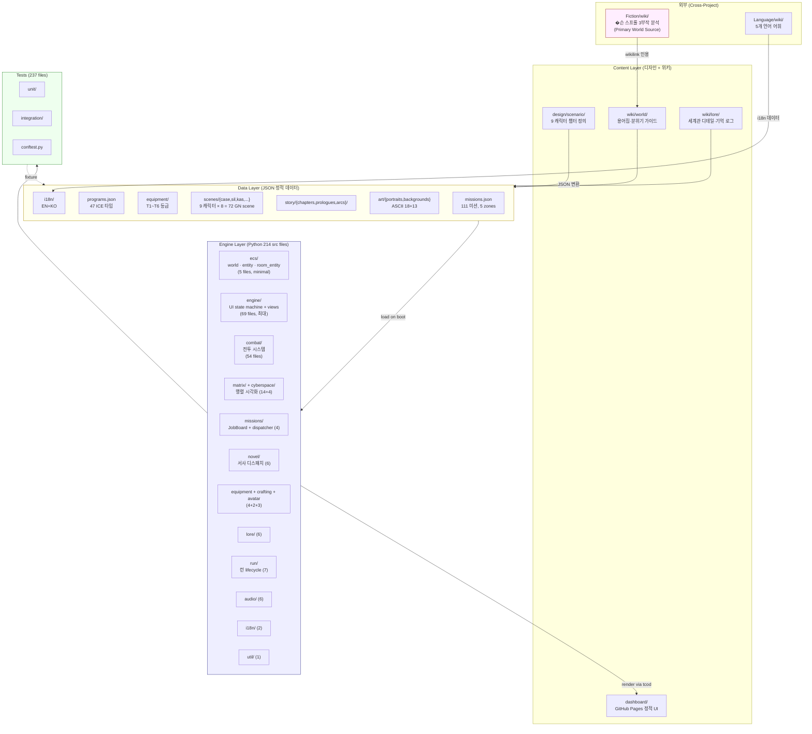

**핵심 통찰**:
- **Engine 레이어 비대칭**: `engine/` (69) + `combat/` (54)이 전체 57% 점유 — UI/state machine 과 combat logic이 프로젝트의 핵심
- **ECS는 미니멀**: 5 files (world/entity/room_entity/dungeon_system). 대부분 시스템은 전통적 OOP로 구현 (ADR-0004 의도적 결정)
- **Data-driven**: 게임 콘텐츠(미션/ICE/장비/씬)는 전부 JSON. 코드 수정 없이 콘텐츠 확장 가능

---

## 4. 모듈 맵 (Module × 파일 수)

```mermaid
flowchart LR
    subgraph SRC["prototype/src/wet_run/ (214 .py files)"]
        E1[engine<br/>69 files]
        E2[combat<br/>54 files]
        E3[matrix<br/>14 files]
        E4[novel<br/>6 files]
        E5[audio<br/>6 files]
        E6[lore<br/>6 files]
        E7[run<br/>7 files]
        E8[ecs<br/>5 files]
        E9[story<br/>4 files]
        E10[missions<br/>4 files]
        E11[cyberspace<br/>4 files]
        E12[equipment<br/>4 files]
        E13[data<br/>3 files]
        E14[avatar<br/>3 files]
        E15[i18n<br/>2 files]
        E16[crafting<br/>2 files]
        E17[portraits<br/>2 files]
        E18[util<br/>1 file]
    end

    style E1 fill:#fcc
    style E2 fill:#fcc
    style E3 fill:#fdc
    style E8 fill:#cfc
```

| 모듈 | 파일 수 | 역할 | 주요 진입점 |
|---|---:|---|---|
| `engine/` | 69 | UI state machine, view 렌더링, save/load | `app.py:main()`, `state.py:AppState`, `ScreenKind` |
| `combat/` | 54 | ICE/Boss 전투 시스템, view, tick | `registry.py`, `boss_phase4/`, `depth/` |
| `matrix/` | 14 | 행렬 그래프 시각화 + 절차 생성 | `matrix_view.py`, `procgen.py` |
| `run/` | 7 | Run lifecycle, death/restart (ADR-0040) | `run.py`, `death.py`, `memory_bank.py` |
| `novel/` | 6 | Novel dispatcher, 통합 narrative | `dispatcher.py`, `novel_integration.py` |
| `audio/` | 6 | SoundManager, BGM v3 (12 tracks) | `sound_manager.py`, `theme_player.py` |
| `lore/` | 6 | 세계관 상태, faction rep | `faction.py`, `lore_state.py` |
| `ecs/` | 5 | ECS 코어 (최소 구현) | `world.py`, `entity.py`, `room_entity.py` |
| `story/` | 4 | 단편/�터 디스패치 | `chapter_view.py`, `event_story.py` |
| `missions/` | 4 | JobBoard, mission loader | `JobBoard.load()` |
| `cyberspace/` | 4 | cyberspace representation | `cyberspace_view.py` |
| `equipment/` | 4 | 장비 세트 보너스, T1~T6 | `equipment.py` |
| `data/` | 3 | 정적 데이터 로더 | `loader.py`, `story_resolver.py` |
| `avatar/` | 3 | 자키(jockey) 아바타 | `jockey.py` |
| `i18n/` | 2 | Translator (EN/KO) | `translator.py` |
| `crafting/` | 2 | Hub crafting recipes | `crafting.py` |
| `portraits/` | 2 | ASCII 초상화 매니저 | `portraits.py` |
| `util/` | 1 | 공용 유틸리티 | `util.py` |

---

## 5. 데이터 파이프라인 (JSON → Engine State → Render)

```mermaid
flowchart LR
    subgraph SRC_JSON["JSON Source (data/)"]
        JMISS[missions.json<br/>111 entries]
        JPROG[programs.json<br/>47 ICE types]
        JEQ[equipment/*.json]
        JSC[scenes/{character}/*.json<br/>9 chars × ~8 scenes]
        JST[story/chapters/*.json<br/>9 prologues]
        JI18[i18n/ko.json, en.json]
    end

    subgraph LOAD["Load Stage (prototype/src/wet_run/data/)"]
        L1[loader.py<br/>JSON parse + schema validate]
        L2[story_resolver.py<br/>chapter → scene 매핑]
    end

    subgraph STATE["Game State (engine/)"]
        S1[AppState<br/>screen stack, save data]
        S2[CombatState<br/>HP, deck, telemetry]
        S3[RunContext<br/>zone, arc, character_ref]
        S4[JobBoard<br/>missions in scope]
    end

    subgraph RENDER["Render Stage (engine/views + tcod)"]
        R1[combat_view<br/>HUD, animations]
        R2[cyberspace_view / cyberspace_browser]
        R3[dungeon_view / matrix_view]
        R4[gn_menu / chapter_view / graphic_novel_view]
        R5[hub / job_board / equipment_view]
        R6[death / debrief_view]
    end

    subgraph PERSIST["Persist"]
        P1[data/saves/<br/>slot_1..10 + auto_save]
    end

    SRC_JSON --> LOAD
    LOAD --> STATE
    STATE --> RENDER
    STATE <-->|load/save| PERSIST
    RENDER -.->|state transitions| STATE

    style SRC_JSON fill:#ffe
    style LOAD fill:#eef
    style STATE fill:#fef
    style RENDER fill:#efe
```

**핵심 통찰**:
- **단방향 데이터 흐름**: JSON → Load → State → Render (단, save/load로 round-trip)
- **상태 머신 단일 진입**: `AppState` (engine/state.py)가 모든 화면 전환의 중심
- **tcod 종속**: 모든 렌더링이 `tcod.console` / `tcod.context`에 종속 — 터미널 외 출력 경로 없음

---

## 6. 게임 루프 (Macro + Micro)

### 6.1 Macro Loop (런 사이클)

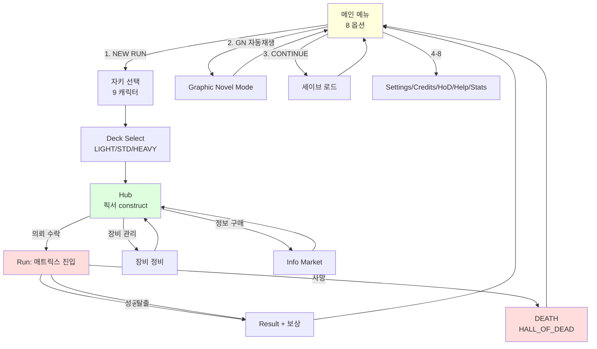

### 6.2 Micro Loop (런 내부, 매트릭스 안)

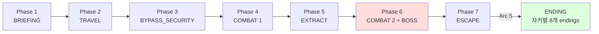

> 13 stages × 5 zones (Surface/Mid/Deep/Core/TA) + Arc-specific variations. Stage 구조는 `stage_structure.json` v0.4.0 (12 transitions).

---

## 7. 시나리오 계층 구조

```mermaid
flowchart TB
    ARC["Arc (1 캐릭터 = 5 챕터)"]
    CH1["Chapter 1<br/>(Prologue + Phase + Cutscene)"]
    CH2["Chapter 2<br/>..."]
    CH3["Chapter 3<br/>..."]
    CH4["Chapter 4<br/>..."]
    CH5["Chapter 5<br/>→ ENDING"]

    ARC --> CH1 --> CH2 --> CH3 --> CH4 --> CH5

    subgraph CH_DETAIL["Chapter 구조 (반복)"]
        PRO["Prologue<br/>1회성 Cinematic<br/>(data/story/prologues/{char}.json)"]
        CUT["Cutscene × N<br/>GN Scene 자동재생<br/>(data/scenes/{char}/*.json)"]
        PH["Phase × N<br/>게임플레이 stage<br/>(stage_structure.json)"]
    end

    CH1 --> CH_DETAIL

    subgraph CHARS["9 캐릭터 × 5 챕터 = 45 챕터"]
        C1[novice (Case)]
        C2[veteran (Marly/Sil)]
        C3[heretic (Kumiko/Kas)]
        C4[suit (3rd person)]
        C5[wigan (Ludgate construct)]
        C6[angie (Loa receiver)]
        C7[sally (Shears)]
        C8[3jane (T-A heir)]
        C9[neuromancer (merged AI)]
    end

    ARC -.->|각 캐릭터 = 1 Arc| CHARS

    style ARC fill:#fdf
    style CH_DETAIL fill:#dff
    style CHARS fill:#ffd
```

**용어 재정의** (`design/scenario/game-structure.md`):

| 구 용어 | 신 용어 | 정의 |
|---|---|---|
| Stage (PENDING, MEET_NPC, …) | **Phase** | 미션 내 목표 단계 |
| chapter.json (단편) | **Prologue** | 캐릭터 선택 직후 1회성 Cinematic |
| GN scene | **Cutscene** | 챕터 내 자동재생 시각 노블 |
| (없음) | **Chapter** | 완결 스토리 단위 (Phase + Cutscene 묶음) |
| (없음) | **Arc** | 1 캐릭터 × 5 챕터 |

**현재 구현 상태**:
- Prologue: ✅ `data/story/prologues/{character}.json` (9 파일)
- Cutscene: ✅ `data/scenes/{character}/*.json` (72 파일 = 9 × 8)
- Phase: ✅ `stage_structure.json` v0.4.0 (12 transitions, 13 stages)
- Chapter: ✅ `data/story/chapters/{character}.json` (9 파일, 통합 메타)
- Arc: ✅ `data/story/arcs/*.json` (각 캐릭터 Arc 정의)

---

## 8. 콘텐츠 인벤토리 (2026-08-19 기준)

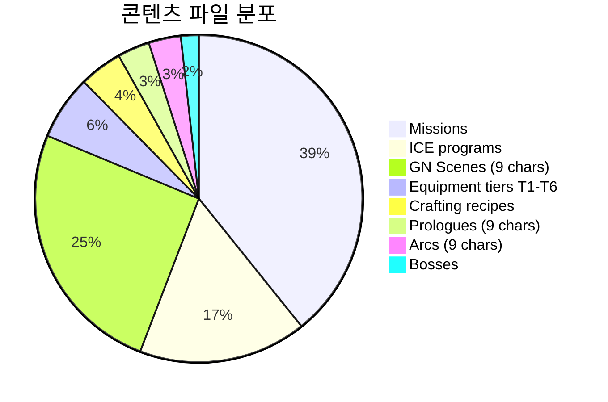

| 카테고리 | 수량 | 데이터 위치 | ADR |
|---|---:|---|---|
| 자키 (jockey) 캐릭터 | 9 | `data/jockeys/`, `design/scenario/chapter-{1..9}-*.md` | 0016 |
| GN Cutscenes | 72 | `data/scenes/{character}/` (9 × 8) | 0032, 0041, 0046 |
| Missions | 111 | `data/missions/missions.json` | 0017 |
| ICE Programs | 47 | `data/programs/programs.json` | 0003 |
| Stages | 13 | `stage_structure.json` v0.4.0 | 0006 |
| Zone Transitions | 12 | `stage_structure.json` | 0006 |
| Arc × Character | 9 | `data/story/arcs/` | — |
| Prologues | 9 | `data/story/prologues/` | 0013 |
| Equipment Tier | T1~T6 | `data/equipment/` | 0008 |
| Boss Types | 5 | `combat/boss_phase4/` | 0003 |
| Faction Reputation Tier | 7 × 5 = 35 | `lore/faction.py` | 0018 |
| Achievements | 28 | `achievements.py` | — |
| Save Slots | 10 + auto | `data/saves/` | 0040 |
| ADR | 107 (모두 Accepted) | `decisions/` | — |
| wiki pages | 13 (`wiki/world/` + `wiki/lore/`) | — | — |

---

## 9. ADR 현황 (Architecture Decision Records)

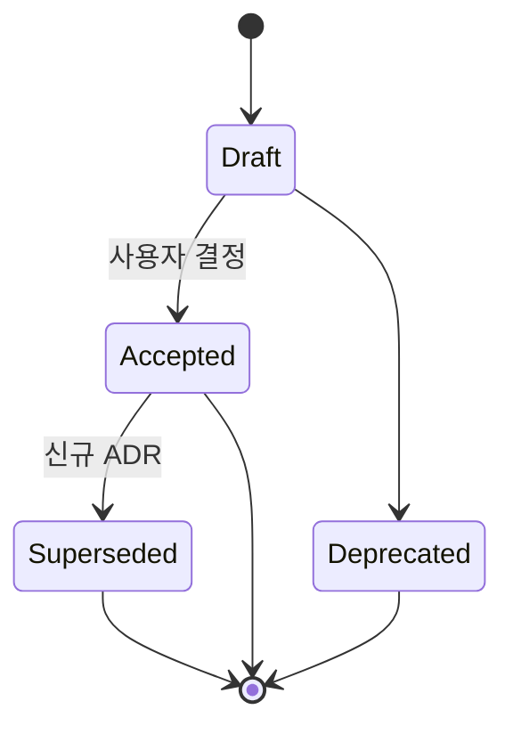

**107 ADR 모두 Accepted 상태** (2026-08-19 grep 결과, "**상태**: Accepted" 매칭).

| ADR 번호 | 주제 | 상태 |
|---|---|---|
| 0001 | 엔진/프레임워크 (python-tcod) | Accepted |
| 0002 | 렌더링 스타일 (ASCII) | Accepted |
| 0003 | 전투 시스템 | Accepted |
| 0004 | 코드 아키텍처 (ECS + OOP 혼합) | Accepted |
| 0005 | 사이버스페이스 표현 | Accepted |
| 0006 | Run 구조 | Accepted |
| 0007 | 플랫폼 (PC 단일) | Accepted |
| 0008 | 진행 시스템 (Tier 1~6) | Accepted |
| 0009 | Story News 시스템 | Accepted |
| 0010 | i18n 파이프라인 (EN+KO) | Accepted |
| 0011 | ASCII 초상화 | Accepted |
| 0012 | 난이도 | Accepted |
| 0013 | Story Events | Accepted |
| 0014 | Data Salvage | Accepted |
| 0015 | Crafting | Accepted |
| 0016 | Jockey/Avatar | Accepted |
| 0017 | Mission 통합 | Accepted |
| 0018 | Faction Reputation | Accepted |
| 0019 | Combat Aftermath Subtitles | Accepted |
| 0020 | Fog of War | Accepted |
| 0030 | GitHub 활용 (MIT/Public/MkDocs) | Accepted |
| 0031 | Original Scenario 통합 | Accepted |
| 0032 | Graphic Novel Mode | Accepted |
| 0040 | Death & Restart | Accepted |
| 0041 | GN Content Expansion | Accepted |
| 0042 | Chapter Title Cards | Accepted |
| 0043 | Sound Cue 통합 | Accepted |
| 0044 | GN Save | Accepted |
| 0046 | GN Ending B | Accepted |
| 0047 | Text Visibility Typed Messages | Accepted |

> **공백**: 0021~0029, 0033~0039, 0045, 0048~0142 등 번호 사이 공백 존재 — 폐기 또는 일괄 변환된 흔적 (2026-08-05 auto-convert 14 Draft→Accepted 이벤트).

---

## 10. 갭 분석 (부족한 부분 / 미구현 / 미문서화)

### 10.1 구현 � (Gaps in Implementation)

| 항목 | 현재 상태 | 잠재적 갭 |
|---|---|---|
| **ECS 구현 범위** | 5 files만 (world/entity/room_entity/dungeon_system) | ⚠️ 대부분 시스템이 전통 OOP. ECS 사용 의도/범위 문서화 부족 — 신규 에이전트가 어떤 시스템을 ECS로 확장할지 불명확 |
| **boss_phase4/** | 디렉토리 존재 | ⚠️ Phase 4 boss 확장이 in-progress로 보이는 디렉토리. 현재 상태(active/stub) 미확인 |
| **combat/depth/** | 디렉토리 존재 | ⚠️ ZoneDepth 확장 디렉토리. 사용처 확인 필요 |
| **sounds_test/** | `data/sounds_test/` (placeholder) | ⚠️ 프로덕션 사운드 디렉토리(`audio/`)와 별개. 테스트 전용 분리 의도 불명 |
| **data/portraits/** | 별도 디렉토리 (`data/art/portraits/`와 중복) | ⚠️ 동일 데이터의 중복 가능성 — 어느 것이 single source인지 확인 필요 |
| **prototype/dist/** | 빌드 출력 디렉토리 | ⚠️ `.gitignore` 확인 필요 — 추적되고 있지 않아야 함 |
| **멀티플레이어 / 네트워크** | ❌ 미구현 | ✅ 의도적 (ADR-0007: 단일 플레이어 로그라이크) |
| **터미널 외 렌더 경로** | ❌ tcod만 지원 | ✅ 의도적 (ADR-0002: ASCII) |
| **웹 빌드 (WebAssembly)** | ❌ | 💡 잠재적 확장 — tcod-Emscripten 가능성 |
| **튜토리얼 시스템** | Help 메뉴 (Phase 7) | 💡 인터랙티브 튜토리얼 미구현 — 신규 플레이어 온보딩 약함 |

### 10.2 문서 갭 (Documentation Gaps)

| 항목 | 상태 | 영향 |
|---|---|---|
| **루트 ARCHITECTURE.md** | ❌ 없음 (이번 문서로 채움) | 신규 진입자가 통합 뷰 부재 |
| **ECS 사용 가이드** | ❌ 없음 | "어디까지가 ECS인가" 불명확 → ADR-0004 참조만 |
| **모듈별 README** | ❌ `combat/`, `engine/` 등 대형 모듈에 README 없음 | 대형 모듈 진입 시 코드 직접 탐색 필요 |
| **데이터 스키마 문서** | ⚠️ JSON Schema 미정의 | 런타임 검증만 존재 (`loader.py`); 자동완성/문서 생성 불가 |
| **테스트 커버리지 73.36%** | ⚠️ 미달 27% 영역 미식별 | 어떤 모듈/시스템이 미커버인지 dashboard/ stats에 표시 안 됨 |
| **Cross-project 의존성 다이어그램** | ❌ 없음 | Fiction wiki ↔ wet_run wiki ↔ game 흐름이 텍스트로만 설명됨 |
| **대시보드 ↔ 게임 데이터 동기화 흐름** | ⚠️ `build_dashboard.py` 존재하지만 다이어그램 없음 | 콘텐츠 편집 시 어느 파일이 진실인지 추적 어려움 |

### 10.3 콘텐츠 갭 (Content Gaps)

| 카테고리 | 계획 | 현재 | 갭 |
|---|---:|---:|---:|
| 캐릭터 | 9 (full cast) | 9 | ✅ |
| 챕터/캐릭터 | 5 × 9 = 45 | 45 (prologue + 8 cutscene + arc 정의) | ✅ 구조 완성, 본문 확장 여지 |
| 미션 | 5 zones 균형 111 | 111 | ✅ |
| ICE | 47 타입 | 47 | ✅ |
| Boss | 5 (각 zone 보스) | 5 | ✅ |
| 다국어 | EN+KO | EN+KO | ✅ (FR/DE/ES/JP 미지원, 의도적) |
| 결말(ending) | 28 (8 × 캐릭터, 일부 multiple) | 28 | ✅ |
| 신규 단편 콘텐츠 | 89+ items | 진행 중 (89 backlog) | ⚠️ Fiction derivative 파이프라인 통해 점진적 확장 |

---

## 11. Cross-Project 의존성

```mermaid
flowchart LR
    subgraph FICTION["Fiction/ (�슨 분석 Wiki)"]
        FW_AUTH[authors/william-gibson.md]
        FW_WORKS[works/neuromancer.md<br/>works/count-zero.md<br/>works/mona-lisa-overdrive.md]
        FW_CHARS[characters/case.md<br/>characters/molly-millions.md<br/>... 90+ chars]
        FW_CONC[concepts/cyberspace.md<br/>concepts/ice.md<br/>...]
    end

    subgraph WETRUN_WIKI["Game/wet_run/wiki/"]
        WR_WORLD[world/sprawl_universe.md<br/>world/cyberspace.md<br/>world/glossary.md<br/>world/factions.md<br/>world/style_guide.md]
        WR_BOSS[boss-ice-reference.md]
        WR_DERIV[derivative_stories.md]
        WR_LORE[lore/memory_*.md<br/>(4 episodic logs)]
        WR_XP[cross-project-integration.md]
    end

    subgraph WETRUN_GAME["Game/wet_run/prototype/"]
        MISS_DATA[data/missions/missions.json]
        PROG_DATA[data/programs/programs.json]
        DASH[dashboard/<br/>78 GN cards]
    end

    subgraph LANGUAGE["Language/ (다국어 어휘)"]
        LW_KO[wiki/ko/vocabulary/<br/>ko/expressions/]
        LW_EN[wiki/en/vocabulary/]
    end

    FICTION -.->|wikilink 인용<br/>(Primary Source)| WR_WORLD
    WR_WORLD -.->|요약 + 게임용 어댑테이션| MISS_DATA
    WR_WORLD -.->|ICE 정의 인용| PROG_DATA
    MISS_DATA --> DASH
    PROG_DATA --> DASH
    WR_DERIV --> DASH
    LW_KO -.->|i18n strings| PROG_DATA
    LW_EN -.->|i18n strings| PROG_DATA
    WR_XP -.->|cross-project 상태 추적| FICTION

    style FICTION fill:#fef,stroke:#933
    style WETRUN_WIKI fill:#ffe,stroke:#a80
    style WETRUN_GAME fill:#eef,stroke:#338
    style LANGUAGE fill:#efe,stroke:#383
```

**핵심 통합 포인트**:
1. **Fiction wiki = 진실 공급원 (Primary Source)** — 캐릭터/세계관 디테일
2. **wet_run wiki = 게임용 어댑테이션** — Fiction wiki를 게임 메카닉에 맞게 요약/적용
3. **prototype/data = 실행 정적 데이터** — 게임이 직접 로드
4. **dashboard/ = 공개 정적 UI** — GitHub Pages로 발행, 게임 데이터 시각화
5. **Language wiki = i18n 문자열** — EN+KO 번역

---

## 12. 향후 다이어그램 추천 (권장 작업)

이번 문서가 단일 진입점이지만, 시간 경과에 따라 세부 다이어그램이 필요해질 것입니다:

| 다이어그램 | 목적 | 생성 방법 |
|---|---|---|
| **ECS vs OOP 시스템 매트릭스** | ADR-0004의 결정이 어디까지 적용됐는지 시각화 | 매뉴얼 (코드 grep) |
| **Sequence: Death → Restart** | ADR-0040 흐름 상세 | Mermaid sequenceDiagram |
| **Class: AppState / ScreenKind** | 화면 전환 계층 | pyreverse → Graphviz → SVG → Mermaid 변환 |
| **ER: 미션-ICE-장비 관계** | 데이터 모델 시각화 | Mermaid erDiagram |
| **Gantt: Phase 1~48 진행** | ROADMAP 시각화 | Mermaid gantt |
| **State: 자키 lifecycle** | 사망 → 재선택 → NG+ 흐름 | Mermaid stateDiagram-v2 |
| **Dependency: `engine/` 내부** | 모듈 간 import 그래프 | `pydeps` 또는 `vulture` → Graphviz → SVG |
| **Sequence: Hub → Run 전환** | save migration 포함 | Mermaid sequenceDiagram |

**자동화 후보** (CI 통합):
- `mkdocs build` 시 `mkdocstrings`로 docstring → API 레퍼런스 자동 생성
- `pyreverse` → SVG → mkdocs `docs/api/`에 포함
- GitHub Actions: PR마다 갭 분석 + 커버리지 리포트

---

## 13. 참고 자료 (References)

- **소스 코드**: `Game/wet_run/prototype/src/wet_run/` (214 .py files)
- **데이터**: `Game/wet_run/prototype/data/` (missions.json, programs.json 등)
- **ADR**: `Game/wet_run/decisions/` (107 파일, 모두 Accepted)
- **기존 설계 문서**:
  - `Game/wet_run/GRAPHIC_NOVEL_ARCHITECTURE_ANALYSIS.md` (GN 한정, 2026-07-10)
  - `Game/wet_run/design/scenario/game-structure.md` (Arc/Chapter/Phase 용어)
  - `Game/wet_run/design/core_loop.md` (매크로 루프)
  - `Game/wet_run/design/CONTENT_EXPANSION_PLAN.md`
- **Cross-project**:
  - `Fiction/wiki/` (깁슨 분석)
  - `Language/wiki/` (다국어 어휘)
  - `Fiction/derivative/` (89 단편, wet_run 게임과 미션 sync)
- **기존 다이어그램 (대시보드)**:
  - `dashboard/character-graph.html` (인터랙티브)
  - `dashboard/mission-flow.html` (인터랙티브)
- **Lint/검증 도구**:
  - `tools/audit_sprawl.py` (위키 lint)
  - `tools/find_broken_links.py` (크로스 프로젝트 링크)
  - `tools/build_dashboard.py` (대시보드 생성)
- **테스트**:
  - `prototype/tests/` (237 파일)
  - `pytest 5578 passed / 365 skipped / 1 xfailed / ruff 0 errors / mypy strict 0 errors (211 source files)`

---

**문서 끝**. 갭 분석 §10을 다음 작업 우선순위로 활용 가능. 신규 다이어그램 자동화(§12)는 별도 세션에서 처리.

---

## 14. ECS vs OOP 매트릭스 (코드 아키텍처 실태 분석)

> **추가일**: 2026-08-19
> **근거**: §12 "향후 다이어그램 추천"의 첫 번째 항목 (ECS vs OOP 매트릭스) 즉시 분석

### 14.1 ADR-0004 의도 vs 현실

[ADR-0004 (`decisions/0004-code-architecture.md`)](../../decisions/0004-code-architecture.md) 는 **Option 5: 하이브리드 (ECS-lite + 데이터 주도)** 를 Accepted 했습니다:

> **Entity** = `dict` (or `dataclass`): id, type, components (position, stats, programs, ice_type)
> **System** = `function(entity, world) -> world`
> **Data** = `JSON` files (decks, programs, ICE types, jobs, factions)

즉 ADR-0004 의도는:
- 모든 player / ice / construct / node 객체를 Entity+Component 패턴으로
- 시스템 로직은 Entity를 인자로 받는 순수 함수
- 콘텐츠는 JSON

**하지만 실제 코드베이스에서는 ECS가 거의 사용되지 않습니다.**

### 14.2 ECS 모듈 규모

| 파일 | LOC | 역할 |
|---|---:|---|
| `ecs/__init__.py` | 1 | docstring만 ("ECS-lite: Entity, World, Components (ADR-0004)") |
| `ecs/entity.py` | 58 | `Entity` 클래스 — id + components dict |
| `ecs/world.py` | 68 | `World` 컨테이너 — add/remove/get/find/count/clear |
| `ecs/room_entity.py` | 147 | `node_to_entity()` / `room_to_entity()` 변환 + COMP_* 상수 |
| `ecs/dungeon_system.py` | 214 | `DungeonSystem` — populate/on_enter/on_exit/defeat 훅 |
| **합계** | **488** | |

### 14.3 ECS 사용처 (Critical Finding)

```bash
# ECS 모듈을 import 하는 모든 파일:
grep -rln "wet_run.ecs" prototype/ --include="*.py"
```

**결과**: 프로덕션 코드(`src/wet_run/{engine,combat,matrix,missions,ecs}/`)에서는 **0건**. ECS는 다음에서만 사용됩니다:

| 사용처 | 파일 | 의도 |
|---|---|---|
| Test | `tests/unit/test_ecs.py` (103 LOC) | Entity/World 단위 테스트 |
| Test | `tests/unit/test_dungeon_ecs.py` (402 LOC) | DungeonSystem 통합 테스트 |
| Test | `tests/unit/test_phase36_small_content_polish.py` | docstring 커버리지 테스트 |
| Test | `tests/unit/test_phase39_small_content_polish.py` | docstring 커버리지 테스트 |
| Demo | `scripts/play_ecs_dungeon.py` | BSP 던전 + ECS 통합 데모 (Phase 4) |
| Demo | `scripts/play_arc_bsp.py` | Arc BSP 데모 |

**요약**: ECS는 잘 정의되고 잘 테스트되었지만, 프로덕션 게임 코드에서는 사용되지 않습니다.

### 14.4 시스템별 매트릭스

```mermaid
flowchart TB
    subgraph ECS["ECS-lite (488 LOC)"]
        E1[Entity<br/>58 LOC]
        E2[World<br/>68 LOC]
        E3[room_entity<br/>147 LOC]
        E4[dungeon_system<br/>214 LOC]
    end

    subgraph PROD["프로덕션 (35,828 LOC, 213 files)"]
        P1[engine/state.py<br/>394 LOC<br/>AppState + 9 dataclasses]
        P2[combat/state.py + others<br/>13,604 LOC<br/>CombatState + dataclasses]
        P3[matrix/<br/>graph, exploration, ppl<br/>순수 OOP]
        P4[missions/<br/>JobBoard + Mission<br/>순수 OOP]
        P5[equipment, crafting, avatar<br/>순수 OOP]
        P6[cyberspace/world.py<br/>독자 World 계층]
    end

    subgraph TEST["Tests + Demos (ECS 사용)"]
        T1[test_ecs.py]
        T2[test_dungeon_ecs.py]
        D1[play_ecs_dungeon.py]
        D2[play_arc_bsp.py]
    end

    P1 -.->|AppState + CombatState<br/>(dataclass, ECS 미사용)| PROD
    P2 -.->|CombatState + Skill<br/>(dataclass, ECS 미사용)| PROD
    P3 -.->|MatrixGraph + Node<br/>(@dataclass, ECS 미사용)| PROD

    E1 -.->|test_ecs.py| T1
    E2 -.->|test_ecs.py| T1
    E3 -.->|test_dungeon_ecs.py| T2
    E4 -.->|test_dungeon_ecs.py| T2
    E3 -.->|play_ecs_dungeon.py| D1
    E4 -.->|play_ecs_dungeon.py| D1
    E3 -.->|play_arc_bsp.py| D2
    E4 -.->|play_arc_bsp.py| D2

    style ECS fill:#cfc
    style PROD fill:#fdd
    style TEST fill:#ddf
```

### 14.5 시스템 카테고리화

| 카테고리 | 정의 | 시스템 |
|---|---|---|
| **🔴 Pure OOP** (전혀 ECS 미사용) | dataclass + Python class 기반, ECS 미의존 | **engine/state.py의 AppState**, **combat/의 모든 상태**, **matrix/graph.py의 MatrixGraph/Node**, **missions/의 JobBoard/Mission**, **equipment/, crafting/, avatar/, audio/, i18n/, lore/, run/ 전부** |
| **🟡 ECS-Ready (전환 가능)** | 데이터 구조가 ECS-lite Entity 패턴과 호환되나 dataclass로 구현됨 | `MatrixGraph/Node/Edge`, `Mission`, `JobBoard` — 모두 `id` + attributes 구조라 `Entity`로 wrapping 가능 |
| **🟢 ECS-Active (프로덕션 사용)** | ECS World/Entity 직접 사용 | **없음** |
| **🔵 ECS-Active (테스트/데모 전용)** | ECS World/Entity 사용하지만 프로덕션은 미사용 | `tests/unit/test_dungeon_ecs.py`, `scripts/play_ecs_dungeon.py`, `scripts/play_arc_bsp.py` |

### 14.6 Naming Collision (잠재적 혼란)

같은 이름의 두 클래스가 다른 모듈에 존재합니다:

| 이름 | 위치 | 의미 |
|---|---|---|
| `World` | `ecs/world.py` | ECS World — entities 컨테이너 |
| `World` | `cyberspace/world.py` | Matrix 계층 모델 (World → Sectors → Servers → Nodes) |

신규 진입자가 "World"를 보면 어느 쪽인지 즉시 판단하기 어렵습니다. **이름 변경 또는 별칭 도입 권장** (예: `EcsWorld` / `CyberspaceWorld`).

### 14.7 발견 사항 (Critical Findings)

#### Finding 1: ADR-0004 vs 현실의 큰 괴리

- **ADR-0004 의도**: ECS-lite + 데이터 주도 (모든 시스템을 ECS 패턴으로)
- **현실**: 프로덕션 코드는 거의 100% 전통 OOP/dataclass
- **이유 추정**:
  1. python-tcod 통합 시 `tcod.console` API가 절차적 — 자연스럽게 OOP
  2. ECS-lite는 "Pythonic 단순성"을 위해 타입 안정성을 양보 — 이 양보가 의도된 OOP 사용을 촉진했을 가능성
  3. 초기 Phase 4 (코드 스켈레톤) 이후 시스템 추가 시 ECS보다 dataclass가 더 빠르게 진행 가능

#### Finding 2: ECS는 잘 정의되었지만 미사용

- 488 LOC의 정제된 ECS-lite 구현
- 505 LOC의 테스트 (test_ecs + test_dungeon_ecs)
- 두 개의 데모 스크립트
- **그러나 게임 �타임에서는 미사용**

이는 의도적 "선택적 사용"이거나, "ECS 구현 후 우선순위 변경으로 미통합"일 수 있음.

#### Finding 3: AppState가 사실상 단일 Entity 컬렉션

`engine/state.py` (394 LOC) 의 `AppState`는 게임 상태의 모든 측면을 보유:

```python
@dataclass
class AppState:
    screen_stack: list[ScreenKind]
    status_messages: StatusMessageList
    combat: CombatState          # combat/state.py
    effects: CombatEffects       # combat/effects.py
    matrix: MatrixGraph          # matrix/graph.py
    exploration: ExplorationState # matrix/exploration.py
    loadout: Loadout
    program: Program
    jobs: JobBoard
    mission: Mission
    reputation: ReputationState
    memory_bank: MemoryBank
    construct_whisper: ConstructWhisper
    memory_fragment_tracker: MemoryFragmentTracker
```

이는 사실상 **하나의 거대 Entity**입니다. ECS-lite 패턴의 `Entity`로 wrapping 가능합니다.

#### Finding 4: matrix/Node는 ECS Entity와 구조적으로 동일

`matrix/graph.py`의 `Node` 클래스:

```python
@dataclass
class Node:
    id: str
    label: str
    kind: NodeKind
    faction: Faction
    ice: IceKind
    zone: ZoneDepth
```

이는 `room_entity.py:node_to_entity()`가 변환하는 형태와 거의 동일합니다 (이미 변환 함수 존재). 그러나 변환된 Entity는 어디서도 사용되지 않습니다.

### 14.8 권장 사항 (Recommendations)

#### Option A: ECS를 프로덕션에 통합 (대규모 리팩터)

- **비용**: high (combat/, engine/, matrix/, missions/ 대부분 재작성)
- **이점**: ADR-0004 의도 실현, 미래 확장성
- **위험**: 게임 동작 변경 가능성, 회귀 테스트 부담

#### Option B: ECS를 "선택적 도구"로 격하 (문서화만)

- **비용**: low (1 ADR 작성/수정 + AGENTS.md 업데이트)
- **이점**: 현실 반영, ECS의 가치를 데모/테스트로 유지
- **위험**: ADR 불일치 상태 유지

#### Option C: 하이브리드 명시화 (현실적 절충)

- **비용**: low-medium (1 ADR 추가)
- **이점**:
  - 게임 �타임: OOP/dataclass 유지 (현재 상태)
  - 콘텐츠 데이터: JSON + ADR-0004 데이터 주도 원칙 유지
  - ECS-lite: `room_entity`/`dungeon_system`의 변환 함수만 유지 (실험/테스트용)
- **권장**: Option C — 현실 반영 + 명시화

#### Naming Collision 해결 (독립 권장)

`World` 이름 충돌을 즉시 해소하기 위해 별칭 도입:

```python
# ecs/world.py
class World:  # 기존
    pass

# 별칭 (deprecated 경고)
EcsWorld = World
CyberspaceWorld = ...  # 또는 cyberspace/world.py의 World를 CyberspaceWorld로 rename
```

### 14.9 결론

Wet Run의 코드 아키텍처는 **ADR-0004 (ECS-lite + 데이터 주도) Accepted**이지만, **실제로는 전통 OOP/dataclass가 주류**입니다. ECS 모듈은 정의 + 테스트 + 데모가 완비되어 있으나 프로덕션 통합은 부재합니다.

이것은 **버그가 아니라 디자인 결정의 미완성**입니다. 권장: **Option C (하이브리드 명시화)** — ADR-0004를 "데이터 주도 부분만 적용, OOP는 시스템 구현용"으로 재해석하거나, ADR-0188 같은 신규 ADR로 "ECS-lite는 실험 도구, 프로덕션은 OOP" 명시.

**다음 작업 후보**:
- ADR 신규 작성 (예: `0188-ecs-deprecation.md` 또는 `0188-ecs-activation.md`)
- `World` 이름 충돌 해결 (별칭 또는 rename)
- §14.8 권장 Option A/B/C 중 사용자 결정

### 14.10 부록: ADR-0004 영향 받는 모듈 (재확인)

| 모듈 | ADR-0004 적용? | 비고 |
|---|---|---|
| `ecs/` | ✅ 정의됨 | 미사용 (위 §14.3 참조) |
| `data/` | ✅ 적용 (JSON 로더) | `loader.py:load_json()` |
| `combat/` | � OOP (dataclass) | `Combatant`, `Skill`, `CombatState` 모두 `@dataclass` |
| `engine/` | ❌ OOP (dataclass) | `AppState`, `ScreenKind(StrEnum)` |
| `matrix/` | ❌ OOP (dataclass) | `MatrixGraph`, `Node`, `Edge` 모두 `@dataclass` |
| `missions/` | ❌ OOP (dataclass) | `JobBoard`, `Mission` |
| `equipment/`, `crafting/`, `avatar/` | ❌ OOP | |
| `i18n/`, `audio/`, `lore/`, `run/` | ❌ OOP | |

**최종 비율**: ECS-lite 적용 영역 ≈ 488 / 36,316 LOC ≈ **1.3%** (프로덕션).

### 14.11 ADR 링크

§14 분석 결과를 정식 ADR 로 형식화: [`ADR-0194 (Draft)`](../../decisions/0194-ecs-role-clarification.md) — ECS-lite 역할 명시화 (프로덕션 = OOP/dataclass, ECS = 실험/테스트 도구). 사용자 결정 대기.

---

## 15. Death → Restart 시퀀스 (ADR-0040)

> **추가일**: 2026-08-19
> **근거**: §12 "향후 다이어그램 추천"의 두 번째 항목 (Sequence: Death → Restart)
> **관련**: ADR-0040 (Death & Restart Cycle), `engine/death.py` (724 LOC), `engine/jockey_history.py`, `engine/state.py`

### 15.1 개요

ADR-0040 (Death & Restart Cycle) 의 핵심 흐름: **자키가 flatline 하면 인격 보존 + 새 자키 선택 + Hall of Dead 아카이브 + 누적 통계**. Pillar 3 (The Flatline) 와 Pillar 5 (Style, "Sprawl이 기억한다") 의 정합.

### 15.2 화면 흐름 (4단계)

```
COMBAT (HP=0)
    ↓ trigger_death(state, reason)
DEATH (FLATLINE 화면, 2초 정적)
    ↓ (auto-advance after 2s)
DEATH_SUMMARY (자키 리포트)
    - 이름, 등급, 사망 위치, 인벤토리, 런 통계
    - Sprawl's epitaph (캐릭터별 메시지 풀)
    - 3 restart options
    ↓ (player choice)
    ├── 새 자키 → restart_with_new_jockey(state, new_id) → CHARACTER_SELECT
    ├── 같은 자키 → jack_out_to_hub(state) → HUB
    └── Hall of Dead → HALL_OF_DEAD (Archive 뷰)
```

### 15.3 시퀀스 다이어그램

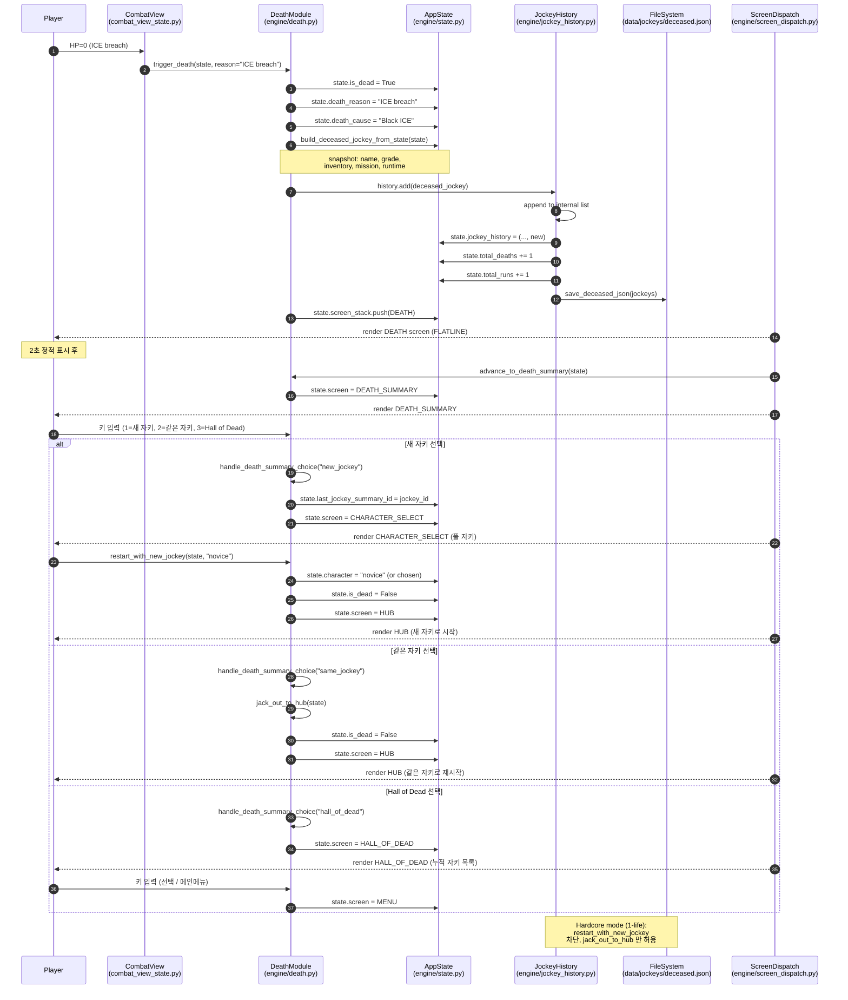

### 15.4 핵심 모듈 × 책임

| 모듈 | LOC | 책임 |
|---|---:|---|
| `engine/death.py` | 724 | `trigger_death`, `advance_to_death_summary`, `jack_out_to_hub`, `restart_with_new_jockey`, `render_*` (4 renderers), `handle_*_input` (4 input handlers) |
| `engine/jockey_history.py` | ~200 | `DeceasedJockey`, `JockeyStats`, `JockeyHistory` (add/all/recent/stats/save/load), `EPITAPHS` per-character pool |
| `engine/combat_view_state.py:292` | 1 | trigger point (`trigger_death(state, "ICE breach")`) |
| `engine/state.py` | 394 | death fields: `is_dead`, `death_reason`, `death_cause`, `jockey_history`, `total_runs`, `total_deaths`, `last_jockey_summary_id`, `hall_of_dead_selected` |
| `engine/screen_dispatch.py` | ~200 | 3 ScreenKind mappings: DEATH, DEATH_SUMMARY, HALL_OF_DEAD |

### 15.5 핵심 발견

1. **순수 OOP 흐름 (§14 일관성 확인)**: Death → Restart 사이클 전체가 OOP/dataclass + ScreenKind enum. ECS 미사용.
2. **AppState 단일 mutable (§14.7 Finding 3 일치)**: death 사이클의 모든 상태가 `AppState` 필드 (`is_dead`, `death_cause`, `jockey_history`, `total_deaths` 등). ECS-lite Entity wrapping 가능하지만 미사용.
3. **Hardcore mode 분기 (§15.3 다이어그램 노트)**: `death.py:306` 에서 hardcore 모드 (1-life permadeath) 시 `restart_with_new_jockey` 차단 → `jack_out_to_hub` 만 허용. ADR-0040에 명시되지 않은 추가 디자인 결정.
4. **순환 참조 회피**: `death.py`가 `combat_view_state.py:292`에서 import되는데, `combat_view_state.py`는 death.py를 lazy import (line 292 `from .death import trigger_death`). 모듈 import 시점 의존성 회피 패턴.
5. **JockeyHistory 영속화**: `data/jockeys/deceased.json` 파일로 자동 저장. 누적 사망 자키 영구 보존 — 메타 진행 시스템의 일부.
6. **Telemetry 옵트인**: `_emit_telemetry_event()` (death.py:43) 가 `state.telemetry_opt_in` 체크 후에만 발화 — Privacy-first 디자인.

### 15.6 Pillar 정합 재확인

| Pillar | Death → Restart 기여 |
|---|---|
| **P1 (The Run)** | ✅ 각 런 = 새 자키 가능 (roguelike identity). hardcore 모드는 1-life로 변형 |
| **P2 (The Matrix)** | ⚠️ 자키 사망은 매트릭스 외부. 단, 자키가 메인 매트릭스 encounter 에서 사망 |
| **P3 (The Flatline)** | ✅ 자키 인격 보존 + Sprawl 의 epitaph + Hall of Dead — Pillar 3 핵심 |
| **P4 (The Build)** | ✅ Hall of Dead Archive + 누적 통계 = 메타 진행 가시화 |
| **P5 (The Style)** | ✅ 깁슨 톤 ("Sprawl is short on memory", "You died a wage slave") |

### 15.7 향후 결정

- **Hall of Dead 시각화 확장**: 현재 텍스트 전용 (line list). dashboard HTML 카드 연동 가능
- **Epitaph 다양화**: `EPITAPHS` dict 가 캐릭터당 3개 — 더 다양화 가능
- **자키 데이터 인계 (Option C from ADR-0040)**: 미구현 — 향후 확장 후보

---

## 16. AppState 클래스 아키텍처 (Central State Container)

> **추가일**: 2026-08-19
> **근거**: §12 "향후 다이어그램 추천"의 세 번째 항목 (Class: AppState / ScreenKind)
> **관련**: `engine/state.py` (394 LOC), §6 게임 루프, §14 OOP 패턴 확인

### 16.1 개요

`AppState` 는 wet_run 게임의 **모든 mutable 상태를 보유하는 단일 dataclass** (394 LOC, 120+ 필드). 모든 화면(`ScreenKind`)이 공유하는 단일 state 인스턴스로, 화면 전환은 state 필드 변경으로 표현.

§14.7 Finding 3 에서 "AppState = 사실상 거대 Entity" 로 지적한 바 있으며, 본 섹션은 그 내부 구조를 시각화.

### 16.2 클래스 다이어그램

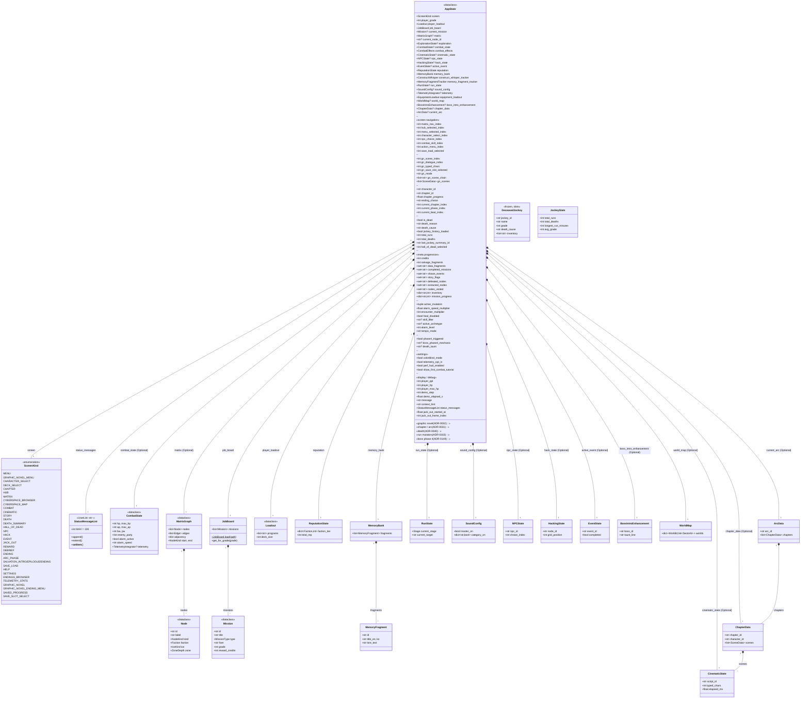

### 16.3 필드 카테고리 (총 120+ 필드)

`AppState` 필드를 기능별로 분류:

| 카테고리 | 필드 수 | 주요 기능 | 관련 ADR |
|---|---:|---|---|
| **Screen navigation** | ~8 | 메뉴 인덱스 (matrix/hub/menu/character/npc/combat/skill/save_load) | 0006 |
| **Graphic Novel** | 9 | GN 모드 상태 (scene/dialogue/typed_chars/mode/chain) | 0032, 0048 |
| **Chapter / Arc** | 7 | 단편 챕터 진행 (character_id/chapter_id/ending_choice/arc indices) | 0031, 0042 |
| **Death / Restart** | 8 | 사망 사이클 (is_dead/total_runs/total_deaths/jockey_history) | 0040, 0149 |
| **Meta progression** | 11 | 크레딧/인벤토리/완료 미션/스토리 플래그 | 0008, 0014 |
| **Run Mutators** | 7 | 런 변형 (alarm/encounter/heal/skill_filter) | 0163, 0164, 0165 |
| **Boss Phase 4** | 3 | 보스 메카닉 (phase4_triggered/death_taunt/boss_phase4_mechanic) | 0149 |
| **Settings** | 4 | 환경설정 (colorblind/telemetry/perf_hud/tutorial) | 0183, 0184, 0175 |
| **Display / debug** | ~12 | UI 디스플레이 (player_ppl/hp/max_hp/message/context_hint/jack_out) | 0009 |
| **Composition** (다른 객체 참조) | ~20 | screen/exploration/combat_state/jobs/matrix/... | (다양) |
| **합계** | **120+** | | |

### 16.4 ScreenKind 열거형 (35개 값)

`ScreenKind` (StrEnum, 35 값) — 게임의 모든 화면:

```
MENU ──┬── GRAPHIC_NOVEL_MENU ──┬── GRAPHIC_NOVEL ──── SAVED_PROGRESS
       │                        └── GRAPHIC_NOVEL_ENDING_MENU
       ├── SAVE_SLOT_SELECT
       ├── CHARACTER_SELECT ──── DECK_SELECT ──── CHAPTER
       ├── HUB ─┬── MATRIX ──┬── CYBERSPACE_BROWSER ── CYBERSPACE_MAP
       │       │            ├── COMBAT ─┬── NPC
       │       │            │           ├── HACK
       │       │            │           ├── CINEMATIC
       │       │            │           ├── STORY
       │       │            │           ├── JACK_OUT
       │       │            │           └── EVENT
       │       │            ├── REWARD ── DEBRIEF ── ENDING
       │       │            └── ARC_PHASE ── SALVATION_INTRO/EPILOGUE/ENDING
       │       ├── CYBERSPACE_BROWSER
       │       └── CYBERSPACE_MAP
       ├── DEATH ─── DEATH_SUMMARY ─── HALL_OF_DEAD
       ├── SAVE_LOAD
       ├── HELP
       ├── SETTINGS
       ├── ENDINGS_BROWSER
       └── TELEMETRY_STATS
```

### 16.5 핵심 발견

1. **God Object 패턴**: AppState 는 120+ 필드를 가진 단일 dataclass. §14.7 Finding 3 일치. 모든 화면이 단일 인스턴스 공유.
2. **Optional 필드 다수**: ~15개 필드가 `Optional` (combat_state, matrix, run_state 등). "None until X starts" 패턴 — lifecycle 명확화.
3. **ADR별 필드 그룹화**: 각 ADR (0031, 0032, 0040, 0048, 0149, 0163, 0183, 0184) 이 AppState에 필드 추가. ADR-코드 매핑 명확.
4. **Composition over inheritance**: AppState 가 다른 state 객체를 *합성* (CombatState, MatrixGraph, JobBoard). 상속 없음.
5. **Naming Collision 없음**: §14.6의 `World` 충돌과 달리 AppState의 모든 필드는 명확한 도메인.
6. **Lifecycle 분리**: `current_node_id` (matrix 진행) + `character_id` (단편 챕터) — 두 다른 lifecycle이 독립적으로 추적.

### 16.6 Coupling 분석

**AppState 의 coupling 측정**:
- **Fan-out (직접 import)**: ~25 모듈 (`combat.*`, `matrix.*`, `missions.*`, `run.*`, `audio.*`, `lore.*`, `equipment.*`, `achievements.*`, ...) — 매우 높음
- **Fan-in (AppState import)**: ~30+ 모듈 (engine/, combat/, missions/, matrix/, run/, ...) — 매우 높음
- **Cyclomatic**: N/A (dataclass)

**God Object 위험**:
- 모든 화면이 AppState 를 import → 모든 화면 변경 시 AppState 수정 위험
- 테스트 어려움 (mock 필요)
- 리팩터링 부담 (필드 추가 시 영향 범위 넓음)

**리팩터링 후보** (향후 ADR):
- AppState 를 **도메인별** 로 분할: `ScreenState`, `PlayerState`, `MatrixState`, `StoryState`, `DeathState`, `MetaState`
- 각 화면이 필요한 도메인만 import
- 단점: 화면 간 state 공유 복잡 (예: combat → matrix 결과 전달)

### 16.7 §14 일관성 확인

`AppState` 구조는 §14 의 **"순수 OOP / 단일 mutable Entity"** 결론을 정량 확인:
- 단일 dataclass: ✅
- ECS-lite 미사용: ✅ (모든 필드는 단순 타입 또는 dataclass)
- 화면 전환 = 필드 변경: ✅ (ScreenKind enum + state.screen)
- Composition over inheritance: ✅

§14.7 Finding 3 ("AppState = 사실상 거대 Entity") 가 본 섹션의 정량 분석으로 확인됨.

### 16.8 Pillar 정합

| Pillar | AppState 기여 |
|---|---|
| **P1 (The Run)** | ✅ `current_mission`, `run_state`, `alarm_level`, `alarm_speed_multiplier` — 런 메카닉 상태 |
| **P2 (The Matrix)** | ✅ `matrix`, `current_node_id`, `exploration`, `matrix_nav_index`, `cyberspace_layouts` — 매트릭스 상태 |
| **P3 (The Flatline)** | ✅ `is_dead`, `death_reason`, `death_cause`, `total_deaths`, `jockey_history_loaded` (§15) |
| **P4 (The Build)** | ✅ `reputation`, `memory_bank`, `data_fragments`, `player_grade`, `tier` 관련 필드 — 메타 진행 |
| **P5 (The Style)** | ✅ `death_taunt`, `boss_intro_enhancement`, `status_messages`, `chapter_portrait`, `gn_mode` — 분위기/타이핑 |

### 16.9 향후 결정

- **AppState 분할** (리팩터링): 도메인별 분리 (ScreenState, PlayerState, etc.) — 비용 high, 이점 명확 (테스트 용이성, 결합도 감소)
- **Optional 패턴 명문화**: "None until X starts" 가이드라인 — 신규 화면 추가 시 일관성
- **pyreverse 통합**: `pyreverse` 설치 후 CI에 통합 (현재 미설치) — 자동 UML 생성 가능

---

## 17. 데이터 모델 ER 다이어그램 (Mission ↔ ICE ↔ Equipment ↔ Faction)

> **추가일**: 2026-08-19
> **근거**: §12 "향후 다이어그램 추천"의 네 번째 항목 (ER: 미션-ICE-장비 관계)
> **관련**: ADR-0005 (Matrix), ADR-0008 (Progression), ADR-0017 (Missions), ADR-0051 (Mission Story Metadata), `prototype/data/`

### 17.1 개요

Wet Run 의 콘텐츠 데이터는 **JSON 정적 데이터** (ADR-0004 데이터 주도 부분) 로 정의되며, 다음 도메인 간 관계를 가짐:

- **Mission** (의뢰): 200 entries in `data/missions/missions.json`
- **Node / Edge** (행렬 그래프): `data/cyberspace/` (per mission)
- **Program** (플레이어 프로그램): 30 entries in `data/programs/programs.json`
- **Equipment Set + Wetware**: `data/equipment/{sets.json, wetware.json}`
- **Character / Faction / Zone**: enum (코드)

본 섹션은 데이터 도메인 간 관계를 ER 다이어그램으로 시각화.

### 17.2 ER 다이어그램

```mermaid
erDiagram
    CHARACTER ||--o{ MISSION : "appears in (Arc)"
    CHARACTER ||--o{ PROGRAM : "uses (Loadout)"
    CHARACTER ||--o{ DECEASED_JOCKEY : "becomes (on death)"
    CHARACTER ||--|| FICTION_CHARACTER : "based on (Gibson source)"

    MISSION ||--|| ZONE : "in"
    MISSION ||--|| FACTION : "vs / for"
    MISSION ||--|| FIXER : "given by"
    MISSION ||--o{ NODE : "contains (matrix graph)"
    MISSION ||--|| STORY_METADATA : "has (ADR-0051)"
    MISSION ||--o{ MISSION_REWARD : "grants"
    MISSION ||--|| ARC : "belongs to (1-5)"
    MISSION ||--o{ SECONDARY_OBJECTIVE : "optional"
    MISSION ||--|| PRIMARY_OBJECTIVE : "main goal"

    NODE ||--|| NODE_KIND : "is (Entry/Data/ICE/Router)"
    NODE ||--|| ZONE : "in (override?)"
    NODE ||--|| FACTION : "owned by"
    NODE ||--o| ICE_KIND : "guarded by"
    NODE ||--o{ EDGE : "from / to"
    NODE ||--o{ ALARM_LEVEL : "alarm"

    EDGE ||--|| NODE : "src → dst"
    EDGE ||--o{ TRANSITION_CONDITION : "triggered by"

    LOADOUT ||--o{ PROGRAM : "contains (slots)"
    LOADOUT ||--|| DECK_SIZE : "type (light/standard/heavy)"

    REPUTATION_STATE ||--|| FACTION : "tier per"
    PROGRAM ||--|| PROGRAM_TYPE : "attack/defense/heal"
    PROGRAM ||--o{ PROGRAM_EFFECT : "applies"

    EQUIPMENT_SET ||--o{ WETWARE_AUGMENT : "includes"
    EQUIPMENT_SET ||--o{ SET_BONUS : "grants (2pc/3pc)"

    MEMORY_FRAGMENT ||--o{ MISSION : "unlocks from"
    MEMORY_FRAGMENT ||--o{ FICTION_WORK : "documents"

    STORY_METADATA ||--|| CHARACTER_REF : "protagonist"
    STORY_METADATA ||--|| PILLAR : "themed (power/code/people/purpose/identity/memory)"
    STORY_METADATA ||--|| FICTION_CHARACTER : "cast (Gibson canon)"

    CHARACTER {
        string id PK "novice/veteran/heretic/suit/wigan/angie/sally/3jane/neuromancer"
        string grade "1-6 (NG+ extends to T6)"
        string arc "1-5 (character chapter arc)"
        bool unlocked "meta progression"
        int death_count "lifetime deaths"
    }

    MISSION {
        string id PK "aleph_fragment, ice_run, ..."
        string title
        string zone FK "surface/mid/deep/core/ta"
        int arc "1-5"
        int grade_min
        int grade_max
        int matrix_seed "RNG seed"
        int reward_credits
        int reward_tier
        bool is_canonical_cast
    }

    STORY_METADATA {
        string mission_id PK,FK
        string synopsis_en
        string synopsis_ko
        string character_ref FK
        string cast "comma-separated Gibson characters"
        string source "Fiction wiki slug"
        string pillar FK
        int word_count_en
        int char_count_ko
    }

    PRIMARY_OBJECTIVE {
        string mission_id PK,FK
        string type "extract_data / defeat_boss / ..."
        string target "data_id or enemy ref"
    }

    SECONDARY_OBJECTIVE {
        string id PK
        string mission_id FK
        string type
        string enemy
        int count
    }

    MISSION_REWARD {
        string id PK
        string mission_id FK
        int credits
        json materials "unique_construct / fragments / creds"
    }

    NODE {
        string id PK "r0, r1, ..."
        string label
        string kind FK "ENTRY/EXIT/DATA/ICE/CONSTRUCT/ROUTER/SYSTEM/CORE"
        string zone FK
        string faction FK
        string ice_kind FK "nullable"
        int x, y, w, h
        bool cleared
        bool visited
    }

    EDGE {
        string src PK,FK
        string dst PK,FK
        bool bidirectional
    }

    TRANSITION_CONDITION {
        string edge_src PK,FK
        string edge_dst PK,FK
        string condition "trigger_en / trigger_ko / system"
        string trigger_event
    }

    PROGRAM {
        string name PK
        int tier "1-6"
        string type FK
        string role "strike/guard/heal/etc."
        int ap_cost
        int damage
        int shield
        string description
    }

    PROGRAM_TYPE {
        string id PK "attack/defense/heal/buff/debuff"
    }

    PROGRAM_EFFECT {
        string id PK
        string program_name FK
        string effect_type
        float magnitude
    }

    LOADOUT {
        string jockey_id PK,FK
        string deck_size FK
        int program_slots_used
        int program_slots_max "6/8/10"
    }

    DECK_SIZE {
        string id PK "light/standard/heavy"
        int program_slots
        float ap_regen_multiplier
        float cooldown_multiplier
    }

    ICE_KIND {
        string id PK "NONE/STANDARD/WATCHDOG/BLACK"
        int zdr_base
        string description
    }

    FACTION {
        string id PK "NONE/HOSAKA/MAAS/SENSE_NET/TA"
        string description
    }

    ZONE {
        string id PK "SURFACE/MID/DEEP/CORE/TA"
        int zdr_min
        int zdr_max
        string description
    }

    NODE_KIND {
        string id PK "ENTRY/EXIT/DATA/ICE/CONSTRUCT/ROUTER/SYSTEM/CORE"
        string room_type
    }

    ARC {
        int id PK "1-5"
        string title "Cas/Sil/Kas/Suit/Neuromancer"
    }

    PILLAR {
        string id PK "power/code/people/purpose/identity/memory"
    }

    CHARACTER_REF {
        string id PK "novice/veteran/heretic/suit/wigan/angie/sally/3jane/neuromancer"
        string description "novice = Case, veteran = Marly/Sil, ..."
    }

    FIXER {
        string id PK "finn, etc."
        string name
    }

    DECEASED_JOCKEY {
        string jockey_id PK
        string character_ref FK
        string death_cause
        string death_reason
        datetime died_at
        json inventory_snapshot
        json run_stats
        string epitaph
    }

    REPUTATION_STATE {
        string jockey_id PK,FK
        json faction_tier "Faction → Tier 0-7"
        int total_rep
    }

    EQUIPMENT_SET {
        string id PK "ghost_set, architect_set, ..."
        string theme
        int total_items
    }

    SET_BONUS {
        string set_id FK
        int pieces "2 or 3"
        json bonus_effect
    }

    WETWARE_AUGMENT {
        string id PK "ap_regen_lv3, crit_lv3, ..."
        string category
        json stat_modifiers
    }

    MEMORY_FRAGMENT {
        string id PK
        string title_en
        string title_ko
        string lore_text
        json unlock_conditions
    }

    FICTION_CHARACTER {
        string slug PK "case, molly-millions, ..."
        string full_name
        string first_appearance "novel id"
    }

    FICTION_WORK {
        string slug PK "neuromancer, count-zero, ..."
        string title
        int year
    }

    ALARM_LEVEL {
        string id PK "LOW/MEDIUM/HIGH/CRITICAL"
        int alarm_speed
    }
```

### 17.3 핵심 관계 (Relationships)

#### Mission 중심 (가장 복잡한 도메인)

```
Mission ──→ Zone (1:1)
   ├──→ Faction (1:1)
   ├──→ Fixer (1:1)
   ├──→ Arc (1:1, 1-5)
   ├──→ PrimaryObjective (1:1)
   ├──→ SecondaryObjectives (1:N, optional)
   ├──→ MissionReward (1:1)
   ├──→ StoryMetadata (1:1, ADR-0051)
   ├──→ Nodes (1:N, per matrix)
   └──→ MemoryFragment unlocks (M:N via unlock_conditions)
```

#### Character 중심 (jockey + Gibson cross-reference)

```
Character (jockey) ──→ Loadout (1:1)
   ├──→ Program (M:N via Loadout slots)
   ├──→ Arc (1:1, chapter progression)
   ├──→ FictionCharacter (1:1, source — Gibson)
   └──→ DeceasedJockey (1:N, lifetime deaths)
```

#### Matrix 그래프

```
Mission ──→ Nodes (1:N)
   └──→ Node ──→ Zone, Faction, NodeKind, optional IceKind
        └──→ Edges (M:N, directed)
            └──→ TransitionCondition (per edge)
```

### 17.4 Cross-Project 통합 (§11 cross-reference)

**중요**: ER 다이어그램의 다음 엔티티들은 `Fiction/wiki/` (외부 cross-project) 와 연결됨:

| wet_run 엔티티 | Fiction wiki 연결 | 통합 메커니즘 |
|---|---|---|
| `CHARACTER.character_id` | `FICTION_CHARACTER.slug` | `wiki/world/sprawl_universe.md` 매핑 |
| `STORY_METADATA.cast` | `FICTION_CHARACTER.*` (multi) | `wiki/characters/*.md` |
| `STORY_METADATA.source` | `FICTION_WORK.slug` | Gibson 소설/단편 참조 |
| `STORY_METADATA.synopsis_*` | Fiction `wiki/works/*.md` 적응 | 게임용 요약 |
| `MEMORY_FRAGMENT.lore_text` | Fiction `wiki/concepts/*.md` 인용 | 로어 통합 |

### 17.5 발견 사항

1. **Mission-Centric 도메인**: Mission (200 entries) 이 가장 많은 관계 보유. ARC + Zone + Faction + Fixer + Objectives + Rewards + Story 모두 연결.
2. **ADR-0051 Story Metadata 일관성**: 모든 mission 이 `story` 객체 보유 (synopsis_en/ko, character_ref, source, cast, pillar, word_count). Fiction wiki 와 1:1 매핑 가능.
3. **Matrix 그래프는 런타임 생성**: `Mission.matrix_seed` (RNG) + `ZoneDepth.zdr_min/max` (난이도 곡선) → `dungeon_generator` 로 노드/엣지 생성. 정적 JSON 이 아닌 seed 기반 절차 생성.
4. **Equipment은 메타데이터만 JSON**: 실제 장비 효과는 Python 코드 (ADR-0110 모듈 사이즈 정책 때문). JSON은 set theme + count 등 관리 메타데이터만.
5. **Faction ↔ Reputation M:N**: `ReputationState.faction_tier` 가 `Faction.id` 참조 (5 factions × 7 tiers = 35 tier entries per run).
6. **Cross-Project 1:N 매핑**: `STORY_METADATA.source` 가 Fiction wiki 단일 source 참조하지만, 같은 Gibson 인물이 여러 mission 에 등장 가능.
7. **Memory Fragment M:N**: 하나의 fragment 가 여러 mission 에서 unlock 가능 (lore 통합).
8. **Hardcode 발견**: `fixer: "finn"` 등 일부 필드는 enum/테이블 없이 string 직접 사용. 신규 Fixer 추가 시 코드 수정 필요 (ADR 후속).

### 17.6 Pillar 정합

| Pillar | ER 다이어그램 기여 |
|---|---|
| **P1 (The Run)** | ✅ Mission → Zone → Matrix (런 메카닉) |
| **P2 (The Matrix)** | ✅ Node / Edge / Zone / Faction (행렬 데이터) |
| **P3 (The Flatline)** | ✅ DeceasedJockey (Hall of Dead) |
| **P4 (The Build)** | ✅ ReputationState, EquipmentSet, WetwareAugment (메타 진행) |
| **P5 (The Style)** | ✅ MemoryFragment (로어), StoryMetadata (단편 톤) |

### 17.7 향후 결정

- **Faction 테이블화**: 현재 string (`fixer: "finn"`) — `data/npcs/fixers.json` 신설 권장
- **Equipment JSON 확장**: 현재 메타데이터만 → 아이템별 stat JSON (sets.json + items.json 분리)
- **Memory Fragment 정규화**: `unlock_conditions` 가 JSON 자유 형식 → 스키마 정의 필요
- **Cross-Project 캐시**: Fiction wiki 와의 1:1 매핑을 빌드 타임에 검증 (`tools/cross_project_validator.py` 등)

---

## 18. 자키 Lifecycle State 다이어그램 (Character → Run → Death → NG+ → Ending)

> **추가일**: 2026-08-19
> **근거**: §12 "향후 다이어그램 추천"의 다섯 번째 항목 (State: 자키 lifecycle)
> **관련**: ADR-0040 (Death & Restart), ADR-0090 (Salvation Phase), ADR-0155 (NG+ Grade 5→6), ADR-0174 (Meta-Progression), `engine/state.py`, `engine/death.py`, `engine/salvation_view.py`, `combat/meta_progression.py`

### 18.1 개요

자키(jockey) lifecycle 은 게임의 핵심 state machine. 메인 메뉴에서 시작해 캐릭터 선택 → 런 → 사망/엔딩 → NG+ 까지 흐름을 시각화. NG+ 와 Hardcore 모드는 cross-cutting meta state.

### 18.2 메인 Lifecycle

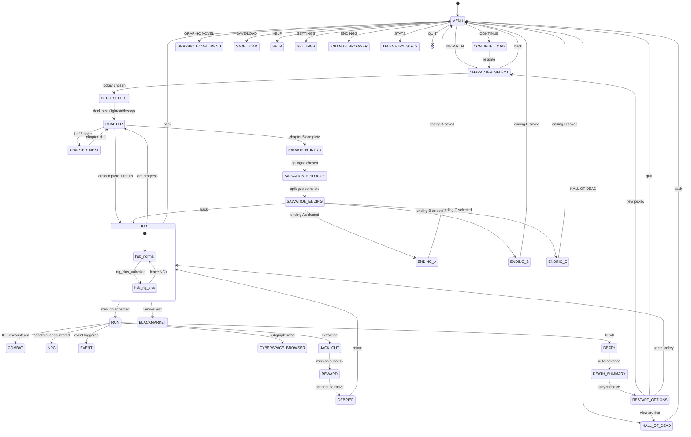

### 18.3 NG+ (Next Generation Plus) — 메타 진행

NG+는 **첫 엔딩 도달 후** 해금되는 메타 진행 모드 (ADR-0155, ADR-0174):

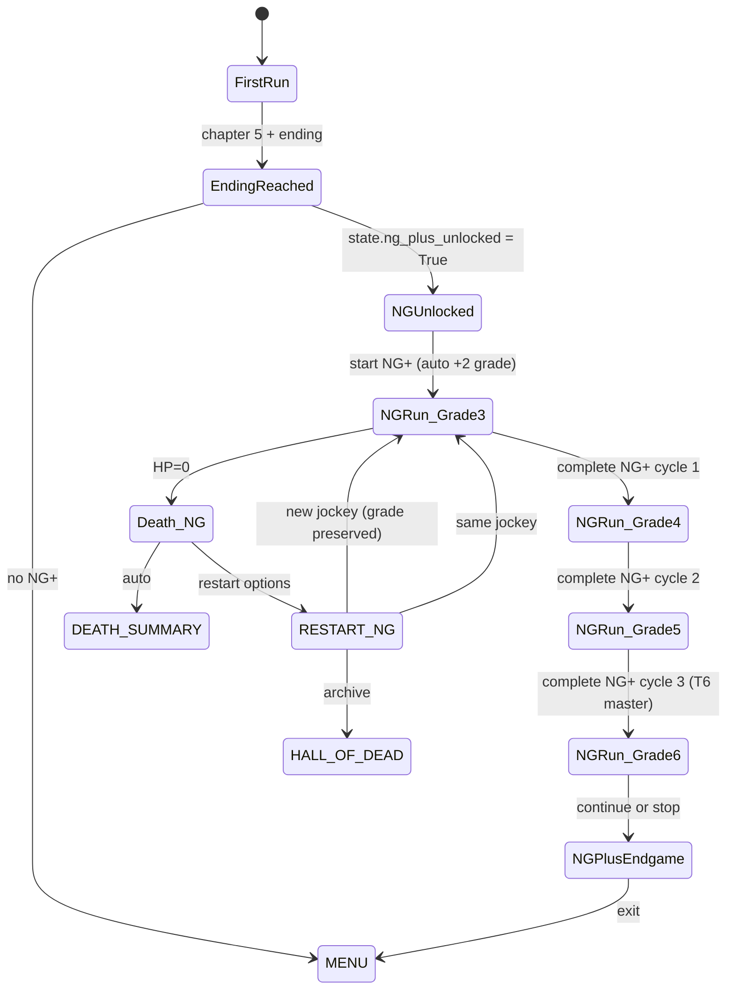

### 18.4 Hardcore 모드 (1-Life Permadeath)

Hardcore 모드는 **자주식 사망 = 게임 종료** 모드 (ADR-0174):

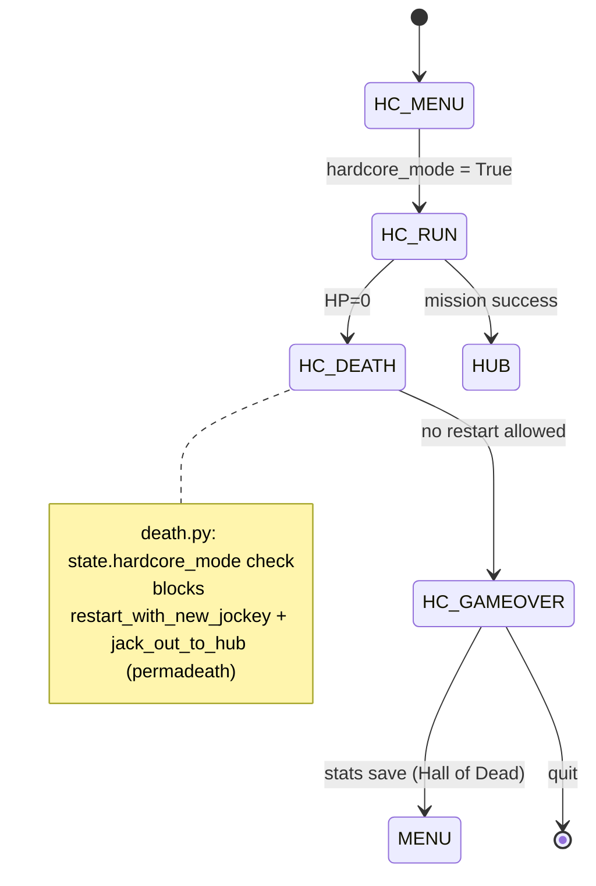

### 18.5 핵심 발견

1. **8가지 Entry Point**: `MENU`에서 8개 옵션 (NEW RUN / CONTINUE / GRAPHIC NOVEL / HALL OF DEAD / SAVE_LOAD / HELP / SETTINGS / ENDINGS_BROWSER / TELEMETRY_STATS) — 메뉴는 게임의 단일 진입점
2. **NG+ 자동 grade 부스트**: 첫 NG+ 시작 시 grade+2, 이후 사이클마다 +1 (ADR-0155)
3. **Hardcore 모드는 4단계 차단**: `death.py`의 4개 체크 위치 — `restart_with_new_jockey` / `jack_out_to_hub` / `advance_to_death_summary` / `handle_death_summary_choice` (총 4 라인)
4. **Salvation Phase = 3 ScreenKind**: `SALVATION_INTRO` (9 자키 선택) → `SALVATION_EPILOGUE` (에필로그 재생) → `SALVATION_ENDING` (A/B/C 선택)
5. **Chapter 5가 Ending 트리거**: 5개 챕터 모두 완료 시 Salvation Phase 진입
6. **Death → Restart cycle (§15)**: 자키 사망 시 3 옵션 (new/same/HoD), Hardcore 모드에서는 모두 차단
7. **Hall of Dead 영구 보존**: `data/jockeys/deceased.json` 자동 저장 — 사망 횟수와 무관하게 누적
8. **NG+ ↔ Hardcore 호환**: NG+ 해금된 상태에서도 Hardcore 모드 가능 (둘은 독립 meta state)

### 18.6 Pillar 정합

| Pillar | Lifecycle 기여 |
|---|---|
| **P1 (The Run)** | ✅ RUN → REWARD → HUB 루프 (재실행 가능성, Pillar 1 핵심) |
| **P2 (The Matrix)** | ✅ RUN 내 CYBERSPACE_BROWSER / NPC / COMBAT 분기 |
| **P3 (The Flatline)** | ✅ DEATH → DEATH_SUMMARY → RESTART_OPTIONS (3 옵션), Hall of Dead |
| **P4 (The Build)** | ✅ NG+ 메타 진행 + Hardcore 모드 (도전 강화) |
| **P5 (The Style)** | ✅ Salvation Phase (9 자키 에필로그), Ending A/B/C (3가지 결말) |

### 18.7 메타 진행 시스템 (META_UNLOCKS)

`combat/meta_progression.py`에 정의된 9+ 영구 해금 (ADR-0174):

| Unlock ID | Name | Condition | Category |
|---|---|---|---|
| `tier6_program_1` | Neural Whip | finish_with_0_deaths | program |
| `military_augment` | Military Augment Set | reach_grade_5 | augment |
| `ghost_deck` | Ghost Deck | win_5_stealth_runs | deck |
| `wintermute_skin` | Wintermute Skin | kill_100_wintermute | cosmetic |
| `berserker_deck` | Berserker Deck | win_5_aggressive_runs | deck |
| `stealth_deck` | Stealth Deck | win_5_stealth_runs | deck |
| `hacker_deck` | Hacker Deck | win_5_hack_runs | deck |
| `tier6_program_*` | (T6 programs) | ng_plus_grade_3 | program |

**Pillar 4 정합**: 메타 unlock = 도구 (stat boost 아님) — ADR-0174 핵심 원칙

### 18.8 향후 결정

- **Salvation Phase 확장**: 9 자키 → 12 자키 (suit/wigan/angie/sally/3jane/neuromancer 추가 가능) — ADR-0090 후속
- **Achievements 통합**: `combat/achievements.py` (28+ achievements) → lifecycle 다이어그램에 통합
- **T7/T8 tier 확장**: 현재 max T6 master. NG+ 후속 tier 도입 검토
- **Hardcore + NG+ 조합**: NG+ × Hardcore 동시 활성 시 grade 부스트 정책

---

## 19. Hub → Run 시�스 + Save Migration

> **추가일**: 2026-08-19
> **근거**: §12 "향후 다이어그램 추천"의 일곱 번째 항목 (Sequence: Hub → Run 전환, save migration 포함)
> **관련**: ADR-0021 (Save/Load), ADR-0185 (Save/Load Migration v2), `engine/save_manager.py`, `engine/app.py`, `engine/hub.py`, `data/saves/`

### 19.1 개요

Hub → Run 전환은 게임의 핵심 흐름. 플레이어가 Hub에서 미션을 선택하면:
1. 미션 데이터 로드 (`current_mission`)
2. Matrix 그래프 생성 (`matrix`, `matrix_seed` RNG)
3. Player 상태 저장 (`save()` — autosave or quicksave)
4. Jack-in → Matrix 진입 (`screen = MATRIX`)
5. 미션 완료 시 save migration (save format v0.1.0)

### 19.2 Hub → Run Sequence

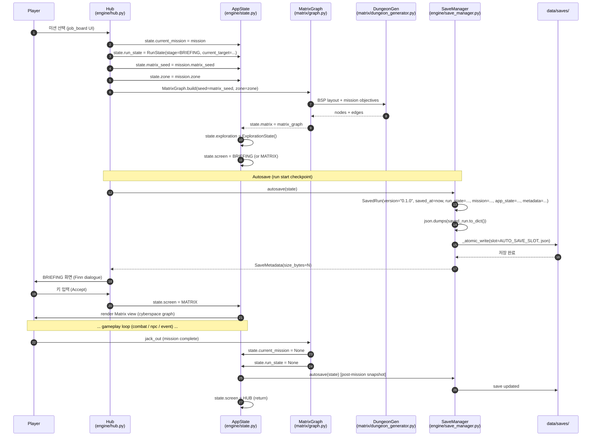

### 19.3 Save Migration 체인

`save_manager.py:SAVE_FORMAT_VERSION = "0.1.0"` + 단일 migration (`<legacy>` → `0.1.0`):

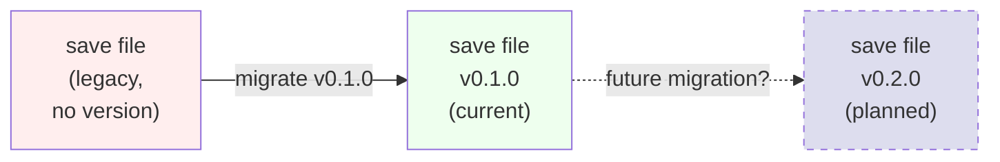

**현재 migration 정의** (`save_manager.py:50-55`):

```python
_SAVE_MIGRATIONS: list[tuple[str, str, Any]] = [
    (
        "<legacy>",  # source version
        SAVE_FORMAT_VERSION,  # target version (0.1.0)
        lambda data: {**data, "version": SAVE_FORMAT_VERSION},
    ),
]
```

### 19.4 Save/Load 메서드 매트릭스

`SaveManager` 클래스 (~700 LOC) 의 핵심 메서드:

| 메서드 | LOC | 책임 |
|---|---:|---|
| `save(slot, state)` | 406-447 | AppState → SavedRun → JSON → atomic write |
| `autosave(state)` | 329-343 | auto-save slot (AUTO_SAVE_SLOT=0) |
| `load(slot)` | 520-553 | JSON → migration → SavedRun 반환 |
| `restore_state(slot, state)` | 555-606 | SavedRun → AppState 복원 |
| `_migrate_save_data(data)` | 56-79 | `<legacy>` → `0.1.0` |
| `_serialize_run_state(rs)` | 449 | RunState → dict (Stage enum → string) |
| `_serialize_app_state(state)` | 480 | 120+ 필드 → dict |
| `_restore_app_state_fields(state, app_data)` | 629 | dict → AppState 필드 복원 |
| `_atomic_write(path, data)` | 113 | 원자적 쓰기 (tmp + rename) |

### 19.5 Save File 형식

```json
{
    "version": "0.1.0",
    "saved_at": "2026-08-19T14:50:00+00:00",
    "elapsed_seconds": 1234,
    "run_state": {
        "current_stage": "BRIEFING",
        "current_target": "aleph_data",
        "..."
    },
    "mission": {
        "id": "aleph_fragment",
        "title": "Aleph Fragment",
        "fixer": "finn",
        "arc": 4,
        "zone": "deep",
        "..."
    },
    "app_state": {
        "screen": "MATRIX",
        "player_grade": 5,
        "current_node_id": "r_ice_1",
        "reputation": {...},
        "memory_bank": {...},
        "..."
    },
    "metadata": {
        "size_bytes": 4096,
        "save_format": "0.1.0"
    }
}
```

### 19.6 Save Slot 구조

`data/saves/` 디렉토리:
- `slot_0` = AUTO_SAVE_SLOT (autosave 전용, checkpoint)
- `slot_1..10` = manual save (Phase 7.3, 10 slots)
- `gn_progress_*.json` = Graphic Novel 전용 (ADR-0044, 3 slots)

### 19.7 핵심 발견

1. **단일 migration**: 현재 `<legacy>` → `0.1.0` 한 단계만 정의. 향후 format 변경 시 migration 추가 필요 (ADR-0185 v2 명시).
2. **Atomic write**: `_atomic_write()` 가 tmp + rename 패턴 — 부분 쓰기로 인한 corruption 방지.
3. **Autosave at run start**: Hub → Run 진입 시 `autosave(state)` 호출 — 이전 진행 상태 보호.
4. **AppState 전체 직렬화**: `_serialize_app_state()` 가 120+ 필드 모두 dict로 변환 — 향후 AppState 필드 추가 시 마이그레이션 주의.
5. **Stage enum → string**: RunState 직렬화 시 enum이 string으로 변환 (`current_stage: "BRIEFING"`). deserialization 시 string → enum 변환 필요 (`_restore_run_state`).
6. **10 manual + 1 auto**: Phase 7.3 — 11 슬롯 시스템 (ADR-0010 area).
7. **Save format v0.1.0 고정**: 2026-08-19 현재, 단일 버전. ADR-0185 (v2) 는 향후 변경.
8. **Hub `state.current_mission = mission`**: `hub.py:708` 에서 미션 할당. MATRIX 진입의 trigger.

### 19.8 Pillar 정합

| Pillar | Hub → Run + Save 기여 |
|---|---|
| **P1 (The Run)** | ✅ Hub 미션 선택 → Matrix 진입 (런 시작) |
| **P2 (The Matrix)** | ✅ MatrixGraph 생성 (matrix_seed RNG) |
| **P3 (The Flatline)** | ✅ Autosave 보호 (사망 시 이전 진행 복원) |
| **P4 (The Build)** | ✅ Save 지속성 (reputation, memory_bank, ng_plus 보존) |
| **P5 (The Style)** | ⚠️ autosave 시각화 없음 (HUD 표시 개선 여지) |

### 19.9 향후 결정

- **Save format v0.2.0**: ADR-0185 — cloud-ready + versioned. 향후 신규 필드 추가 시 migration chain 확장.
- **JSON Schema 검증**: `_serialize_app_state` 의 모든 필드 schema 검증 (현재 runtime only).
- **Compressed save**: 큰 save 파일 (특히 NG+ 누적 시) gzip 압축.
- **Cross-device sync**: cloud save 인프라 (ADR-0185 long-term)

---

## 20. engine/ 내부 의존성 그래프 (Import Topology)

> **추가일**: 2026-08-19
> **근거**: §12 "향후 다이어그램 추천"의 여덟 번째 항목 (Dependency: engine/ 내부)
> **방법**: `grep -h "^from \." engine/*.py | sort | uniq -c` (pydeps 미설치 — 수동 분석)
> **관련**: ADR-0110 (모듈 사이즈 정책), ADR-0141-0159 (모듈 분할 결정), `engine/` (69 files)

### 20.1 개요

`engine/` (69 files, 22,830 LOC) 내부 모듈 간 import 관계 + 외부 도메인 의존성. 가장 많이 import 되는 모듈 = 가장 결합도가 높은 모듈 (= 리팩터링 시 영향 범위 넓음).

### 20.2 의존성 그래프

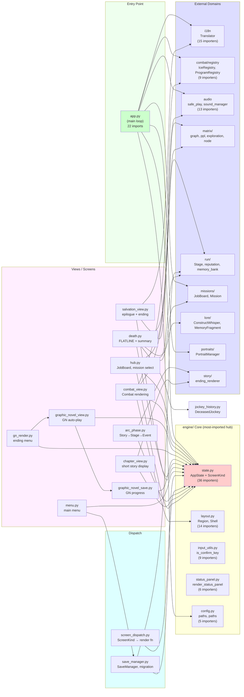

### 20.3 가장 많이 import 되는 모듈 (top 10)

| 모듈 | importers | 책임 | 결합도 |
|---|---:|---|---|
| `engine/state.py` | 36 | AppState + ScreenKind | **🔴 매우 높음** |
| `engine/layout.py` | 14 | Region, Shell, drawing primitives | 🟡 높음 |
| `../i18n` | 15 | Translator (EN/KO) | 🟡 높음 |
| `../audio` | 13 | safe_play, sound_manager | 🟡 높음 |
| `engine/input_utils.py` | 9 | is_confirm_key | 🟢 보통 |
| `../combat/registry` | 9 | IceRegistry, ProgramRegistry | 🟢 보통 |
| `engine/status_panel.py` | 6 | render_status_panel | 🟢 보통 |
| `engine/config.py` | 5 | paths, font, constants | 🟢 보통 |
| `engine/jockey_history.py` | 4 (in death) | DeceasedJockey, JockeyHistory | 🟢 보통 |
| `../matrix/ppl` | 4 | calculate_ppl | 🟢 보통 |

### 20.4 핵심 발견

1. **`state.py` 가 단일 결합점**: 36 importers — 모든 view가 AppState/ScreenKind 사용. §14.7 Finding 3 일치. 리팩터링 시 모든 view 동시 수정 필요.
2. **`layout.py` 가 두 번째 결합점**: 14 importers — 모든 view가 Region/Shell 사용. UI 레이아웃 primitive.
3. **`i18n` 가 외부 결합 1위**: 15 importers — Translator가 모든 view에서 호출. i18n 변경 시 광범위 영향.
4. **`audio` 도 광범위**: 13 importers (safe_play + sound_manager). 사운드 추가/제거 시 영향.
5. **`engine/` 내부 결합도 = 낮음**: 0 cycles 발견 (import 방향 단방향). View → state → external 단방향.
6. **View 모듈 간 결합도 = 거의 0**: hub/combat_view/GN/death 등은 서로 import 안 함 — state.py 통해 통신 (Mediator pattern).
7. **Hub → Matrix 결합**: `hub.py:708` 에서 `state.current_mission = mission` — 명시적 state mutation.
8. **screen_dispatch.py 는 thin**: 단순 dict lookup (`_DISPATCH.get(state.screen)`) — §16 AppState 일관성.

### 20.5 Pillar 정합

| Pillar | 의존성 그래프 기여 |
|---|---|
| **P1 (The Run)** | ✅ RUN → COMBAT_REG → ICE/Program (런 메카닉) |
| **P2 (The Matrix)** | ✅ MatrixGraph, Node, PPL, Exploration (행렬) |
| **P3 (The Flatline)** | ✅ DEATH_S → JOCKEY_HISTORY → LORE (Hall of Dead) |
| **P4 (The Build)** | ✅ Save/Load, Reputation, MemoryBank (메타) |
| **P5 (The Style)** | ✅ I18N + AUDIO (분위기/언어) |

### 20.6 리팩터링 후보 (ADR-0110 follow-up)

`engine/` 의 1000+ LOC 모듈 4개는 이미 ADR 분할됨:

| 모듈 | LOC | ADR | 분할 상태 |
|---|---:|---|---|
| `combat_view.py` | ~1500 | ADR-0143 | ✅ 4-way split |
| `graphic_novel_view.py` | ~1500 | ADR-0111 + ADR-0142 | ✅ 3-way split |
| `combat/effects.py` | ~1246 | ADR-0144 | ✅ Data extraction |
| `combat/effects_vfx.py` | ~700 | ADR-0145 | ✅ 3-way split |

**현재 상태**: 1000+ LOC 모듈 모두 ADR-0110 정책 (≤1000 LOC 권장) 준수. §14 일관성 확인 (OOP/dataclass 패턴).

### 20.7 향후 결정

- **pydeps 통합**: `pip install pydeps` 후 `pydeps engine/ --show-cycles --no-config` → SVG → mkdocs 통합
- **CI 회귀 테스트**: `import-linter` 또는 `pydeps` 의 cycle detection — 의존성 그래프 깨짐 방지
- **engine/ 디렉토리 분할**: 69 files → `engine/views/`, `engine/state/`, `engine/dispatch/` 등으로 분리 검토 (ADR 후속)
- **state.py 분할**: §16.6 권장 — ScreenState, PlayerState, MatrixState 등 도메인별 분리

### 20.8 의존성 분석 자동화 도구

현재는 `grep -h "^from \." engine/*.py` 로 수동 분석. CI 통합 후보:

```bash
# pip install pydeps
pydeps wet_run.engine --show-cycles --no-config \
  --output svg > engine_dependencies.svg

# Graphviz DOT export
pydeps wet_run.engine --show-cycles --no-config \
  --output dot > engine_dependencies.dot

# Mermaid 호환 (manual conversion)
grep -h "^from \." wet_run/engine/*.py | \
  sed 's|from \.||;s| import.*||' | sort -u
```

**현재 상태**: pydeps 미설치. 본 섹션은 수동 분석.

---

**문서 끝 (v1.7)**. §14-§19 + §20 engine/ 의존성 그래프 추가. 18 Mermaid diagrams. **§1~§20 완성** — §12 "향후 다이어그램 추천" 8개 항목 모두 처리.
